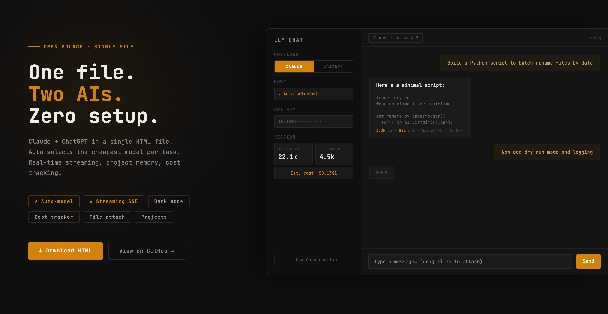
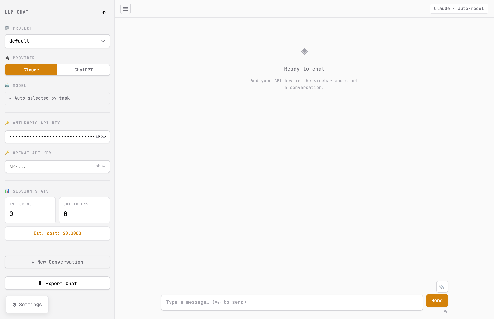
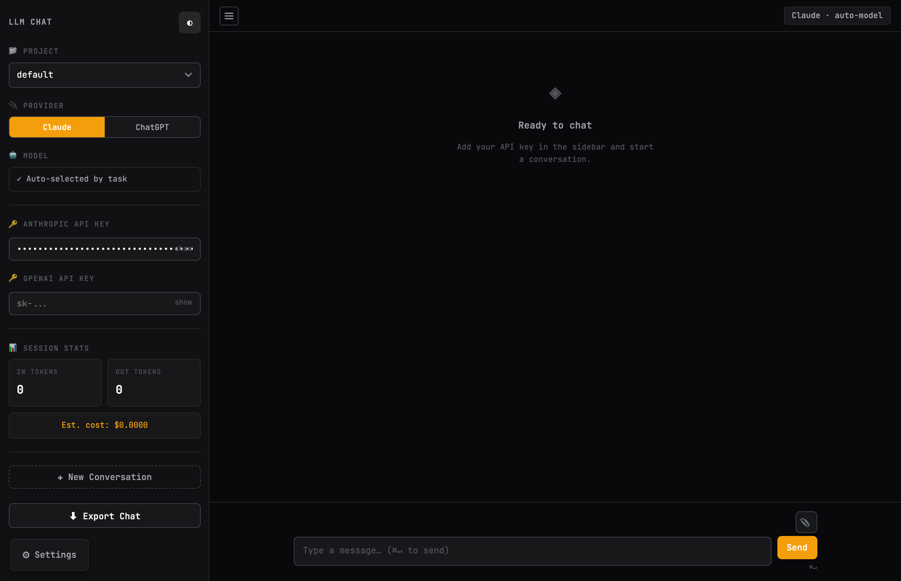
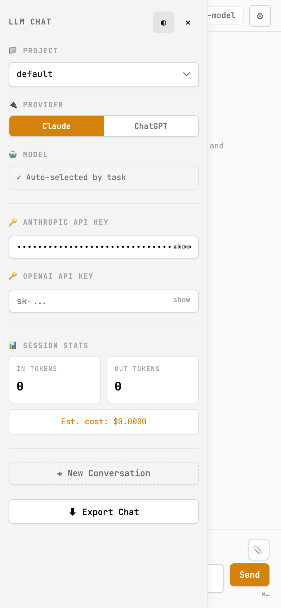

# LLM Chat

> One HTML file. Two AI providers. Zero setup.

Chat with Claude and ChatGPT from a single browser file — no npm, no backend, no build step. Drop it anywhere and start chatting.

---

## Screenshots

<table>
<tr>
<td></td>
<td></td>
</tr>
<tr>
<td align="center"><em>Light mode</em></td>
<td align="center"><em>Dark mode</em></td>
</tr>
</table>

  
   <em>Mobile — sidebar slides in as overlay</em>

---

## Features

**Auto-model selection** — Automatically picks the cheapest Claude or OpenAI model that fits the task. Haiku for quick Q&A, Sonnet for coding and synthesis, Opus for deep reasoning. Switch providers mid-conversation with one click.

**Real-time streaming** — Both Claude (Anthropic SSE) and ChatGPT (OpenAI SSE) stream responses token-by-token. Stop generation at any time.

**Cost tracking** — Tokens in, tokens out, and estimated USD cost displayed after every response. Session totals in the sidebar.

**Projects** — Organize conversations into named projects. Persisted in IndexedDB — survives page refreshes.

**File attachments** — Drag-and-drop or click-to-attach. Up to 5MB per file.

**Dark mode** — System-aware, manually toggleable. Persists across sessions.

**Export** — One-click Markdown export of any conversation.

**Font controls** — Body font, size, and line-height adjustable from settings.

---

## Quickstart

1. Download [`LLM_Chat.html`](./LLM_Chat.html)
2. Open it in any modern browser
3. Add your Anthropic and/or OpenAI API key in the sidebar
4. Start chatting

No server. No install. No dependencies.

---

## Model auto-selection logic

| Task signal | Claude model | OpenAI model |
|---|---|---|
| Short question, quick edit, fact lookup | `claude-haiku-4-5` | `gpt-4o-mini` |
| Coding, drafting, synthesis, analysis | `claude-sonnet-4-6` | `gpt-4o` |
| Architecture, deep reasoning, strategy | `claude-opus-4-6` | `o1-preview` |

Override anytime by editing the system prompt in settings.

---

## API keys

Keys are stored in your browser's `localStorage` — they never leave your machine. A warning banner reminds you not to use the app on shared computers.

- Anthropic: [console.anthropic.com](https://console.anthropic.com)
- OpenAI: [platform.openai.com](https://platform.openai.com)

---

## Pricing reference

| Model | Input (per 1M tok) | Output (per 1M tok) |
|---|---|---|
| claude-haiku-4-5 | $0.80 | $4.00 |
| claude-sonnet-4-6 | $3.00 | $15.00 |
| claude-opus-4-6 | $15.00 | $75.00 |
| gpt-4o | $5.00 | $15.00 |
| gpt-4-turbo | $10.00 | $30.00 |
| o3-mini | $1.50 | $6.00 |

Costs shown are estimates. Check provider pricing pages for current rates.

---

## Tech

- Vanilla HTML + CSS + JS — no framework
- IndexedDB for conversation and project storage
- Anthropic Messages API with SSE streaming
- OpenAI Chat Completions API with SSE streaming
- `localStorage` for settings and API keys
- Google Fonts: JetBrains Mono + Lora

---

## Browser support

Any modern browser with `fetch`, `ReadableStream`, and `IndexedDB` support. Chrome, Firefox, Safari, Edge — all current versions work.

---

## License

MIT — do whatever you want with it.

---

## Contributing

PRs welcome. Keep changes minimal and single-file. Open an issue before large refactors.
